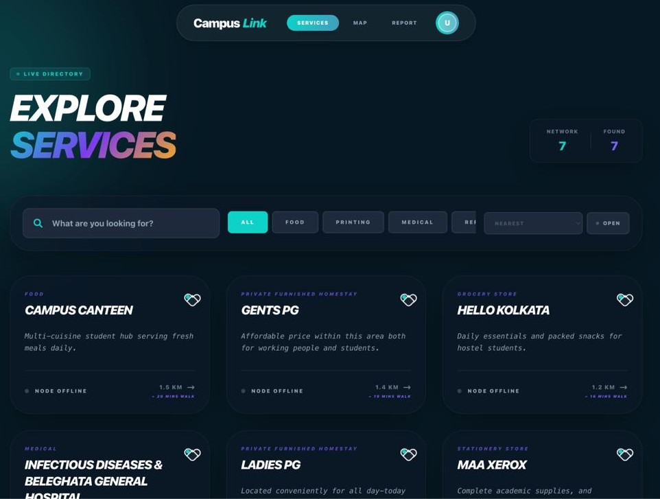
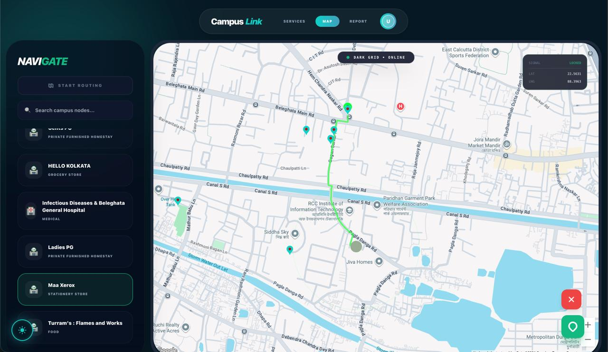
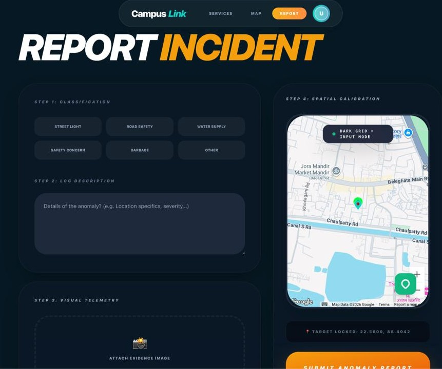

# CampusLink

CampusLink is a student-centric web platform designed to connect college campuses with nearby local services through a safe, reliable, and easy-to-use digital experience. The platform helps students discover verified services, navigate their surroundings, and actively contribute to improving their campus and local environment.

---

## 📸 Screenshots

### Services Discovery

  

### Interactive Map

  

### Report an Issue

  

---

## ✨ Features

- **Public Landing Page**  
  A visually rich home page that introduces the platform, its purpose, and its core offerings without requiring login.

- **Authentication-Based Access Control**  
  Users can browse the home page freely, but access to services is protected. Login or signup is required only when users try to access specific features.

- **Interactive Map Experience**  
  A dynamic map interface that allows users to explore their campus and surrounding areas.

- **Nearby Services Discovery**  
  Students can find essential nearby services such as food outlets, print shops, and other local utilities.

- **Route Navigation**  
  Users can view routes between locations to better understand distances and paths around their campus area.

- **Issue Reporting System**  
  Students can report local issues such as:
  - Broken street lights
  - Unsafe areas
  - Infrastructure problems  
  Reports can be created by:
  - Selecting a location directly on the map
  - Using the user’s current GPS location  
  Users can also upload images to provide visual context for reported issues.

---

## 🚀 Minimum Viable Product (MVP)

The current version of CampusLink focuses on delivering the core functionality required to validate the idea:

- Public home page with guided entry into services
- Frontend-based authentication using local storage
- Interactive map with place discovery
- Basic route navigation using Google Maps services
- Location-based issue reporting with image upload support

This MVP establishes the foundation for future safety, verification, and intelligence-driven features.

---

## 🛠 Tech Stack

- **Frontend:** React, TypeScript, Tailwind CSS
- **Routing:** React Router
- **State Management:** Local state & browser storage
- **Maps & Location Services:** Google Maps Platform

---

## 🗺️ Google Technologies Used

The platform uses the following Google Maps Platform APIs:

- **Google Maps JavaScript API**  
  Used to render interactive maps and handle map-related UI interactions.

- **Google Places API**  
  Enables place search and discovery of nearby services around the campus.

- **Google Directions API**  
  Provides routing and navigation data between locations.

---

## 📌 Project Status

CampusLink is currently in active development. The focus is on refining user experience, improving map interactions, and expanding the reporting and safety features.

---

## 🔮 Future Scope
 
- Verified vendor onboarding and moderation  
- Safety-aware route optimization  
- Real-time alerts and community reporting validation  
- Image moderation and report status tracking  
- Mobile-first optimizations

---

## 🤝 Contributing

Contributions, ideas, and feedback are welcome. Feel free to fork the repository and submit pull requests.

---

## 📄 License

This project is currently under development and intended for educational and experimental use.
